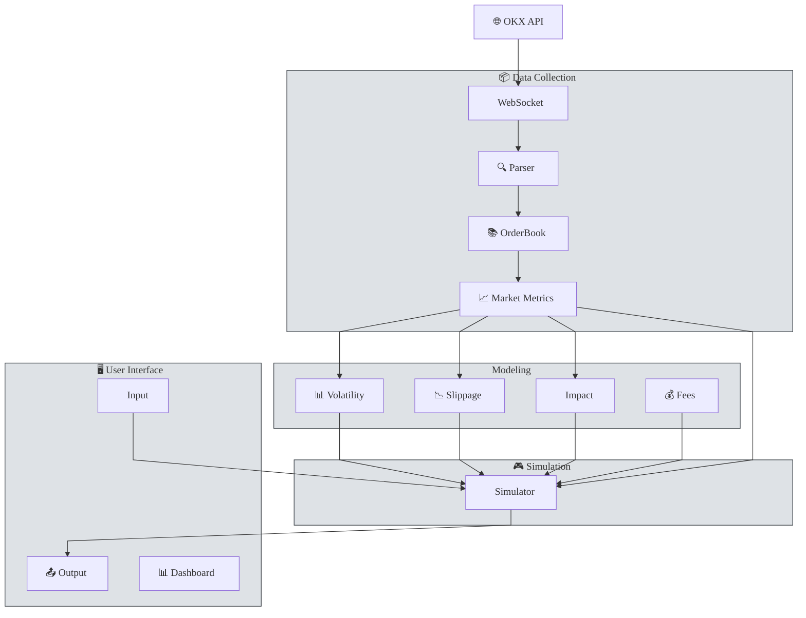
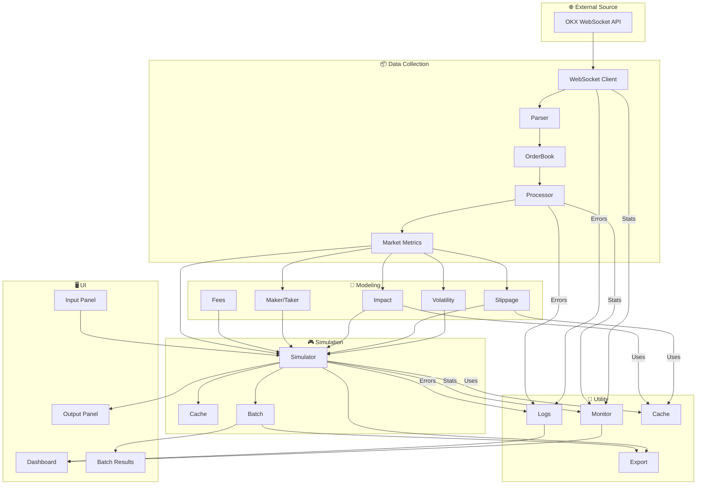
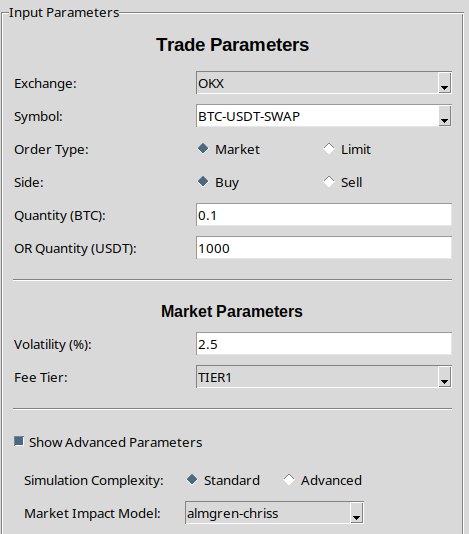
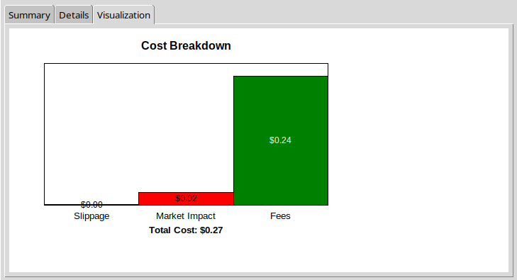
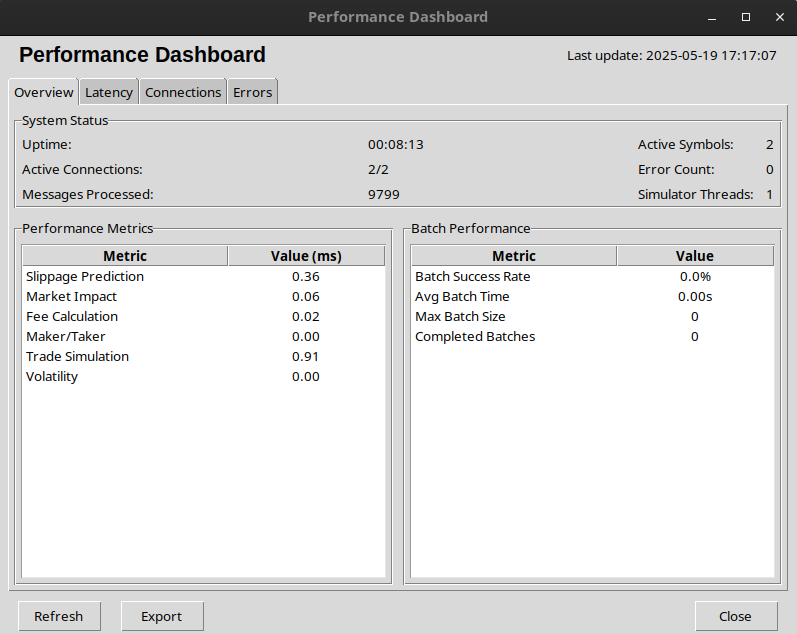
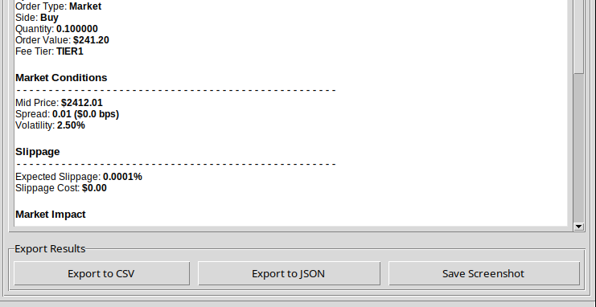
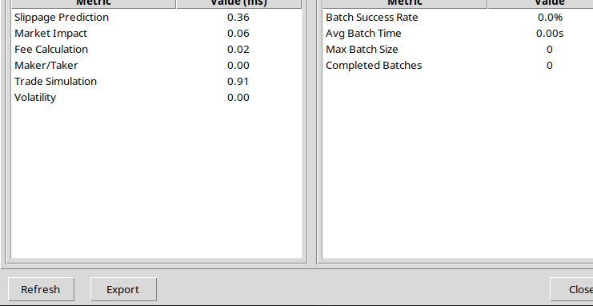

# Aegis - Crypto Trade Simulator

[](https://www.youtube.com/watch?v=nSK02p2Wpbw)

## Table of Contents
- [Aegis - Crypto Trade Simulator](#aegis---crypto-trade-simulator)
  - [Table of Contents](#table-of-contents)
  - [Overview](#overview)
  - [System Architecture](#system-architecture)
  - [Data Flow](#data-flow)
  - [Component Documentation](#component-documentation)
    - [Data Structures](#data-structures)
    - [Services](#services)
    - [Models](#models)
    - [User Interface](#user-interface)
    - [Utilities](#utilities)
  - [User Guide](#user-guide)
    - [Installation](#installation)
    - [Running the Application](#running-the-application)
    - [Using the Simulator](#using-the-simulator)
    - [Performance Dashboard](#performance-dashboard)
    - [Batch Simulations](#batch-simulations)
    - [Exporting Results](#exporting-results)
  - [Current Status \& Roadmap](#current-status--roadmap)
    - [Completed Features](#completed-features)
    - [Known Issues](#known-issues)
    - [Future Enhancements](#future-enhancements)

## Overview

The Crypto Trade Simulator is a high-performance application designed to simulate trading costs and market impact for cryptocurrency trades. It connects to real-time market data from cryptocurrency exchanges (currently OKX) via WebSocket, processes L2 orderbook data, and uses financial models to estimate various costs associated with trading.

**Key Features:**
- Real-time L2 orderbook data processing
- Market impact modeling using the Almgren-Chriss model
- Slippage prediction with regression models
- Fee calculation based on exchange fee tiers
- Maker/taker proportion estimation
- Batch simulation capabilities
- Performance monitoring and metrics visualization
- Data export to CSV and JSON formats

The simulator provides a user-friendly interface for traders and analysts to estimate transaction costs before executing trades, helping to optimize trading strategies and reduce costs.

## System Architecture



The Crypto Trade Simulator is built using a modular architecture with the following high-level components:

1. **Data Collection Layer**
   - WebSocket client for real-time market data
   - Data normalization and processing

2. **Modeling Layer**
   - Slippage prediction models
   - Market impact models
   - Fee calculation logic
   - Maker/taker proportion estimator
   - Volatility calculator

3. **Simulation Core**
   - Trade simulation engine
   - Batch processing capabilities
   - Result caching and optimization

4. **User Interface Layer**
   - Input parameter controls
   - Simulation results display
   - Performance monitoring dashboard
   - Data visualization
   - Export functionality

5. **Utility Layer**
   - Logging and error handling
   - Performance monitoring
   - Data export utilities
   - Caching mechanisms

The system uses a multi-threaded architecture to ensure responsive UI while processing data streams and running simulations in the background.

## Data Flow

<!--  -->


1. **Market Data Ingestion**
   - WebSocket clients connect to OKX and receive L2 orderbook data
   - Raw JSON data is parsed into structured OrderBook objects
   - Data is validated and normalized

2. **Data Processing**
   - OrderBook data is processed to extract key metrics
   - Volatility is calculated based on price movements
   - Market conditions are analyzed for simulation inputs

3. **Simulation Process**
   - User inputs trade parameters via the UI
   - Parameters are passed to the simulation engine
   - Models calculate slippage, market impact, and fees
   - Results are aggregated and returned to the UI

4. **Results Presentation**
   - Simulation results are displayed in the UI
   - Visualizations show cost breakdown
   - Performance metrics are updated
   - Results can be exported to CSV or JSON

5. **Performance Monitoring**
   - System latency and throughput are tracked
   - Connection status is monitored
   - Error logging and recovery mechanisms are active

## Component Documentation

### Data Structures

<details>
<summary><strong>OrderBook</strong></summary>

The `OrderBook` class represents a snapshot of the order book at a specific point in time. It contains lists of asks and bids, each represented as an `OrderBookLevel` with a price and quantity.

**Key Methods:**
- `from_json()`: Creates an OrderBook from a JSON string  
- `best_ask()`: Returns the best (lowest) ask price  
- `best_bid()`: Returns the best (highest) bid price  
- `mid_price()`: Returns the mid price between best bid and ask  
- `spread()`: Returns the bid-ask spread  
- `depth_at_price()`: Returns the total quantity available at a given price level  
</details>

<details>
<summary><strong>OptimizedOrderBook</strong></summary>

An optimized version of the OrderBook that uses NumPy arrays for better performance.

**Key Features:**
- Memory-efficient storage of price levels  
- Optimized calculations for depth and other metrics  
- Compatible with the standard OrderBook interface  
</details>

<details>
<summary><strong>MarketMetrics</strong></summary>

Contains calculated metrics derived from the order book data.

**Fields:**
- `timestamp`: Time of the metrics calculation  
- `symbol`: Trading symbol  
- `mid_price`: Mid price between best bid and ask  
- `spread`: Bid-ask spread  
- `bid_depth`: Total quantity on the bid side  
- `ask_depth`: Total quantity on the ask side  
- `volatility`: Short-term price volatility estimate  
</details>

### Services

<details>
<summary><strong>WebSocketClient</strong></summary>

Manages connections to exchange WebSocket endpoints and processes incoming data.

**Key Methods:**
- `connect()`: Establishes connection to the WebSocket server  
- `disconnect()`: Closes the WebSocket connection  
- `reconnect()`: Attempts to reconnect after a connection failure  
- `receive_messages()`: Processes messages from the WebSocket  
- `connect_and_receive()`: Main method to start the client  
</details>

<details>
<summary><strong>DataProcessor</strong></summary>

Processes raw orderbook data into usable metrics for simulation.

**Key Methods:**
- `process_orderbook()`: Transforms an orderbook into market metrics  
- `get_current_metrics()`: Returns the most recent market metrics  
- `get_current_orderbook()`: Returns the most recent orderbook  
</details>

<details>
<summary><strong>TradeSimulator</strong></summary>

Core simulation engine that combines models to calculate trade costs.

**Key Methods:**
- `update_market_data()`: Updates the simulator with the latest market data  
- `simulate_trade()`: Executes a trade simulation with given parameters  
- `start_batch_simulation()`: Runs multiple simulations with parameter variations  
- `get_performance_metrics()`: Returns metrics about simulator performance  
</details>

### Models

<details>
<summary><strong>SlippageModel</strong></summary>

Predicts slippage for market orders based on orderbook data.

**Key Methods:**
- `update()`: Updates the model with new orderbook data  
- `predict_slippage_linear()`: Predicts slippage using linear regression  
- `predict_slippage_quantile()`: Predicts slippage at a specific quantile level  
</details>

<details>
<summary><strong>MarketImpactModel</strong></summary>

Calculates market impact of trades using various models including Almgren-Chriss.

**Key Methods:**
- `calculate_impact()`: Calculates impact based on trade parameters  
- `get_model_info()`: Returns information about the current model  
</details>

<details>
<summary><strong>FeeCalculator</strong></summary>

Calculates exchange fees based on fee tiers and maker/taker proportions.

**Key Methods:**
- `calculate_fees()`: Calculates fees for a given order value and fee tier  
- `get_tier_details()`: Returns details for a specific fee tier  
</details>

<details>
<summary><strong>MakerTakerEstimator</strong></summary>

Estimates the proportion of an order likely to be executed as maker vs taker.

**Key Methods:**
- `estimate_proportion()`: Estimates maker/taker proportion based on market conditions  
</details>

<details>
<summary><strong>VolatilityCalculator</strong></summary>

Calculates volatility using multiple methods including EWMA.

**Key Methods:**
- `add_price()`: Adds a new price observation  
- `get_volatility()`: Returns volatility estimates using different methods  
</details>

<details>
<summary><strong>OrderExecution</strong></summary>

Simulates order execution for different order types.

**Key Methods:**
- `estimate_execution()`: Estimates execution characteristics for different order types  
</details>

### User Interface

<details>
<summary><strong>MainWindow</strong></summary>

Main application window that coordinates all UI components.

**Key Methods:**
- `run()`: Starts the main UI event loop  
- `update_market_data()`: Updates the market data display  
- `update_simulation_results()`: Updates the simulation results display  
- `show_performance_dashboard()`: Opens the performance monitoring dashboard  
</details>

<details>
<summary><strong>InputPanel</strong></summary>

Panel for inputting simulation parameters.

**Key Fields:**
- `exchange_var`, `symbol_var`, `order_type_var`, etc.: Variables for user inputs  
- `on_simulate`: Callback function for the simulate button  
</details>

<details>
<summary><strong>OutputPanel</strong></summary>

Panel for displaying simulation results.

**Key Methods:**
- `update_market_data()`: Updates the market data display  
- `update_simulation_results()`: Updates the simulation results display  
- `_create_cost_breakdown_chart()`: Creates a visual breakdown of costs  
</details>

<details>
<summary><strong>PerformanceDashboard</strong></summary>

Dashboard for monitoring system performance.

**Key Methods:**
- `refresh()`: Updates all dashboard tabs  
- `update_performance_data()`: Updates performance metrics  
- `update_connection_data()`: Updates connection statistics  
- `update_error_data()`: Updates error log  
</details>

### Utilities

<details>
<summary><strong>Caching</strong></summary>

Caching utilities to improve performance of expensive calculations.

**Key Components:**
- `LRUCache`: Least Recently Used cache for function results  
- `@memoize`: Decorator for memoizing function results  
</details>

<details>
<summary><strong>Export</strong></summary>

Data export utilities for saving simulation results.

**Key Functions:**
- `export_results_to_csv()`: Exports simulation results to CSV format  
- `export_batch_results_to_csv()`: Exports batch simulation results to CSV  
- `export_results_to_json()`: Exports simulation results to JSON format  
</details>

<details>
<summary><strong>Logging</strong></summary>

Logging configuration and setup.

**Key Function:**
- `setup_logging()`: Configures logging for the application  
</details>

<details>
<summary><strong>Performance</strong></summary>

Performance monitoring and measurement utilities.

**Key Components:**
- `LatencyTracker`: Tracks operation latency for performance monitoring  
- `@measure_latency`: Decorator for measuring function execution time  
</details>

## User Guide

### Installation

1. **Prerequisites**
   - Python 3.8 or higher
   - VPN access to connect to OKX (public market data only)

2. **Setup**
   ```bash
   # Clone the repository (placeholder URL)
   git clone https://github.com/PsychoPunkSage/Aegis
   cd Aegis
   
   # Create a virtual environment
   python -m venv venv
   source venv/bin/activate  # On Windows: venv\Scripts\activate
   
   # Install dependencies
   pip install -r requirements.txt
   ```

### Running the Application

To start the application:

```bash
python app.py
```

For Dockerized version:

```bash
# Need to give docker, the permission to use host display
xhost +local:docker

# Build Docker image
sudo docker build -t aegis .

# Run the image
sudo docker run -it --rm -e DISPLAY=$DISPLAY -v /tmp/.X11-unix:/tmp/.X11-unix aegis

# Revoke the permission
xhost -local:docker
```

This will:
1. Connect to the configured WebSocket endpoints
2. Open the main UI window
3. Begin processing market data

### Using the Simulator

<h4>1. Configure Input Parameters</h3>

<div style="display: flex; flex-wrap: wrap; align-items: flex-start; gap: 20px; margin-bottom: 20px;">
  <div style="flex: 1 1 300px; min-width: 280px;">
    <ul>
      <li><strong>Select exchange</strong> (currently only OKX is supported)</li>
      <li><strong>Choose trading symbol</strong> (e.g., BTC-USDT-SWAP)</li>
      <li><strong>Select order type</strong> (market, limit, etc.)</li>
      <li><strong>Choose trade side</strong> (buy or sell)</li>
      <li><strong>Enter quantity</strong> in base currency or quote currency</li>
      <li><strong>Set market parameters</strong> like volatility and fee tier</li>
    </ul>
  </div>

  <div style="flex: 1 1 300px; min-width: 280px;">
    
  </div>
</div>

<!-- Step 2: Run Simulation -->
<h4>2. Run Simulation</h4>

<div style="display: flex; flex-wrap: wrap; align-items: flex-start; gap: 20px; margin-bottom: 20px;">
  <div style="flex: 1 1 300px; min-width: 280px;">
    <ul>
      <li>Click the <strong>Simulate Trade</strong> button</li>
      <li>Wait for the simulation to complete</li>
    </ul>
  </div>

  <div style="flex: 1 1 300px; min-width: 280px;">
    
  </div>
</div>

<h4>3. View Results</h4>

   - The Summary tab shows the basic cost breakdown
   - The Details tab provides comprehensive metrics
   - The Visualization tab displays a chart of costs

|  |  |
| :----------------------------------------: | :------------------------------------------: |
|              **Summary Data**              |              **Summary Graph**               |


### Performance Dashboard

<div style="display: flex; flex-wrap: wrap; align-items: flex-start; gap: 20px; margin-bottom: 20px;">
  <div style="flex: 1 1 300px; min-width: 280px;">
    <p><strong>To open the performance dashboard:</strong></p>
    <ol>
      <li>Click "Tools" in the menu bar</li>
      <li>Select "Performance Dashboard"</li>
    </ol>
    <p><strong>The dashboard has four tabs:</strong></p>
    <ol>
      <li><strong>Overview</strong>: Shows system status and key performance metrics</li>
      <li><strong>Latency</strong>: Displays detailed latency statistics for different operations</li>
      <li><strong>Connections</strong>: Shows status and statistics for WebSocket connections</li>
      <li><strong>Errors</strong>: Displays error log for troubleshooting</li>
    </ol>
  </div>

  <div style="flex: 1 1 300px; min-width: 280px;">
    
  </div>
</div>

### Batch Simulations

To run a batch simulation:
1. Click "Tools" in the menu bar
2. Select "Batch Simulation"
3. Configure base parameters and variations
4. Click "Run Batch Simulation"

The results will be displayed in a separate window with:
- Summary statistics for all simulations
- Detailed breakdown of each variation
- Export functionality for further analysis

### Exporting Results

<!-- Results can be exported in several ways:
1. **From Simulation Results**
   - Click "File" → "Export Results"
   - Choose CSV or JSON format
   - Select destination file

2. **From Batch Simulation**
   - Click "Export to CSV" in the batch results window
   - Select destination file

3. **From Performance Dashboard**
   - Click "Export" in the dashboard
   - Select destination file


 -->

<div style="display: flex; flex-wrap: wrap; align-items: flex-start; gap: 20px; margin-bottom: 20px;">
  <div style="flex: 1 1 300px; min-width: 280px;">
    <p><strong>Results can be exported in several ways:</strong></p>
    <ol>
      <li><strong>From Simulation Results</strong>
        <ul>
          <li>Click "File" → "Export Results"</li>
          <li>Choose CSV or JSON format</li>
          <li>Select destination file</li>
        </ul>
      </li>
      <li><strong>From Batch Simulation</strong>
        <ul>
          <li>Click "Export to CSV" in the batch results window</li>
          <li>Select destination file</li>
        </ul>
      </li>
      <li><strong>From Performance Dashboard</strong>
        <ul>
          <li>Click "Export" in the dashboard</li>
          <li>Select destination file</li>
        </ul>
      </li>
    </ol>
  </div>

  <div style="flex: 1 1 300px; min-width: 280px;">
    
    
  </div>
</div>

## Current Status & Roadmap

### Completed Features

- ✅ Basic project structure and architecture
- ✅ WebSocket client for OKX connection
- ✅ L2 orderbook data processing
- ✅ Market metrics calculation
- ✅ Core financial models (slippage, impact, fees)
- ✅ Basic trade simulation engine
- ✅ User interface with input and output panels
- ✅ Performance dashboard for monitoring
- ✅ Basic data export functionality
- ✅ Error tracking and logging
- ✅ Multi-symbol support

### Known Issues

- ⚠️ Performance Dashboard does not persist properly when closed and reopene (**Use `Top Left X` instead of `Close` Button**)
- ⚠️ Some UI elements are not properly sized for different screen resolutions
- ⚠️ Batch simulations is not properly integrated with UI.

### Future Enhancements

- 🔄 Exchange & Strategy Expansion
  - Add support for more exchanges
  - Integrate strategy backtesting and portfolio-level simulation

- 🔄 Advanced Order Types
  - Connect advanced order models to the UI and simulation engine
- 🔄 Performance & Caching
  - Use threading, optimized orderbook, and LRU/memoization caching to improve speed
- 🔄 Market Modeling Improvements
  - Refine slippage, market impact, and volatility models with fallback handling
- 🔄 Error Recovery & Data Quality
  - Add circuit breakers, quality checks, and fallback mechanisms for robustness
- 🔄 Export & Persistence
  - Finalize export (CSV/JSON) and save/load configuration with result history