# Aegis - Crypto Trade Simulator

## Table of Contents
- [Aegis - Crypto Trade Simulator](#aegis---crypto-trade-simulator)
  - [Table of Contents](#table-of-contents)
  - [Overview](#overview)
  - [System Architecture](#system-architecture)
  - [Data Flow](#data-flow)
  - [Component Documentation](#component-documentation)
    - [Data Structures](#data-structures)
      - [OrderBook](#orderbook)
      - [OptimizedOrderBook](#optimizedorderbook)
      - [MarketMetrics](#marketmetrics)
    - [Services](#services)
      - [WebSocketClient](#websocketclient)
      - [DataProcessor](#dataprocessor)
      - [TradeSimulator](#tradesimulator)
    - [Models](#models)
      - [SlippageModel](#slippagemodel)
      - [MarketImpactModel](#marketimpactmodel)
      - [FeeCalculator](#feecalculator)
      - [MakerTakerEstimator](#makertakerestimator)
      - [VolatilityCalculator](#volatilitycalculator)
      - [OrderExecution](#orderexecution)
    - [User Interface](#user-interface)
      - [MainWindow](#mainwindow)
      - [InputPanel](#inputpanel)
      - [OutputPanel](#outputpanel)
      - [PerformanceDashboard](#performancedashboard)
    - [Utilities](#utilities)
      - [Caching](#caching)
      - [Export](#export)
      - [Logging](#logging)
      - [Performance](#performance)
  - [User Guide](#user-guide)
    - [Installation](#installation)
    - [Running the Application](#running-the-application)
    - [Using the Simulator](#using-the-simulator)
    - [Performance Dashboard](#performance-dashboard)
    - [Batch Simulations](#batch-simulations)
    - [Exporting Results](#exporting-results)
  - [Current Status \& Roadmap](#current-status--roadmap)
    - [Completed Features](#completed-features)
    - [Known Issues](#known-issues)
    - [Future Enhancements](#future-enhancements)

## Overview

The Crypto Trade Simulator is a high-performance application designed to simulate trading costs and market impact for cryptocurrency trades. It connects to real-time market data from cryptocurrency exchanges (currently OKX) via WebSocket, processes L2 orderbook data, and uses financial models to estimate various costs associated with trading.

**Key Features:**
- Real-time L2 orderbook data processing
- Market impact modeling using the Almgren-Chriss model
- Slippage prediction with regression models
- Fee calculation based on exchange fee tiers
- Maker/taker proportion estimation
- Batch simulation capabilities
- Performance monitoring and metrics visualization
- Data export to CSV and JSON formats

The simulator provides a user-friendly interface for traders and analysts to estimate transaction costs before executing trades, helping to optimize trading strategies and reduce costs.

## System Architecture

```mermaid

%%{init: {
  "theme": "default",
  "themeVariables": {
    "background": "#f8f9fa",
    "primaryColor": "#ced4da",
    "primaryTextColor": "#212529",
    "primaryBorderColor": "#495057",
    "clusterBkg": "#dee2e6",
    "clusterBorder": "#343a40",
    "fontSize": "16px",
    "fontFamily": "Segoe UI, sans-serif"
  },
  "flowchart": { "curve": "linear" }
}}%%
flowchart TD

    %% External Source
    OKX[🌐 OKX API] --> WS[🔌 WebSocket]

    %% Data Collection
    subgraph DataCollection["📦 Data Collection"]
        WS --> Parser[🔍 Parser]
        Parser --> OB[📚 OrderBook]
        OB --> MM[📈 Market Metrics]
    end

    %% Modeling
    subgraph Modeling["🧠 Modeling"]
        MM --> VC[📊 Volatility]
        MM --> SM[📉 Slippage]
        MM --> MIM[🌊 Impact]
        FC[💰 Fees]
    end

    %% Simulation
    subgraph Simulation["🎮 Simulation"]
        TS[🧪 Simulator]
    end

    %% UI
    subgraph UI["🖥️ User Interface"]
        IP[📝 Input] --> TS
        TS --> OP[📤 Output]
        PD[📊 Dashboard]
    end

    %% Core Interactions
    VC --> TS
    SM --> TS
    MIM --> TS
    FC --> TS
    MM --> TS
```



The Crypto Trade Simulator is built using a modular architecture with the following high-level components:

1. **Data Collection Layer**
   - WebSocket client for real-time market data
   - Data normalization and processing

2. **Modeling Layer**
   - Slippage prediction models
   - Market impact models
   - Fee calculation logic
   - Maker/taker proportion estimator
   - Volatility calculator

3. **Simulation Core**
   - Trade simulation engine
   - Batch processing capabilities
   - Result caching and optimization

4. **User Interface Layer**
   - Input parameter controls
   - Simulation results display
   - Performance monitoring dashboard
   - Data visualization
   - Export functionality

5. **Utility Layer**
   - Logging and error handling
   - Performance monitoring
   - Data export utilities
   - Caching mechanisms

The system uses a multi-threaded architecture to ensure responsive UI while processing data streams and running simulations in the background.

## Data Flow

```mermaid
flowchart TD
    subgraph ExternalSource["🌐 External Source"]
        OKX[OKX WebSocket API]
    end

    subgraph DataCollection["📦 Data Collection"]
        WS[WebSocket Client]
        Parser[Parser]
        OB[OrderBook]
        DP[Processor]
        MM[Market Metrics]
    end

    subgraph Modeling["🧠 Modeling"]
        VC[Volatility]
        SM[Slippage]
        MIM[Impact]
        MTM[Maker/Taker]
        FC[Fees]
    end

    subgraph Simulation["🎮 Simulation"]
        TS[Simulator]
        RC[Cache]
        BS[Batch]
    end

    subgraph UI["🖥️ UI"]
        IP[Input Panel]
        OP[Output Panel]
        PD[Dashboard]
        BR[Batch Results]
    end

    subgraph Utility["🧰 Utility"]
        LG[Logs]
        PM[Monitor]
        EX[Export]
        CA[Cache]
    end

    OKX --> WS
    WS --> Parser --> OB --> DP --> MM
    MM --> VC --> TS
    MM --> SM --> TS
    MM --> MIM --> TS
    MM --> MTM --> TS
    FC --> TS
    MM --> TS

    TS --> RC
    TS --> BS
    IP --> TS --> OP
    BS --> BR
    PM --> PD
    TS --> EX
    BS --> EX

    WS -->|Stats| PM
    DP -->|Stats| PM
    TS -->|Stats| PM

    WS -->|Errors| LG
    DP -->|Errors| LG
    TS -->|Errors| LG
    LG --> PD

    SM -->|Uses| CA
    MIM -->|Uses| CA
    TS -->|Uses| CA
```

<!--  -->


1. **Market Data Ingestion**
   - WebSocket clients connect to OKX and receive L2 orderbook data
   - Raw JSON data is parsed into structured OrderBook objects
   - Data is validated and normalized

2. **Data Processing**
   - OrderBook data is processed to extract key metrics
   - Volatility is calculated based on price movements
   - Market conditions are analyzed for simulation inputs

3. **Simulation Process**
   - User inputs trade parameters via the UI
   - Parameters are passed to the simulation engine
   - Models calculate slippage, market impact, and fees
   - Results are aggregated and returned to the UI

4. **Results Presentation**
   - Simulation results are displayed in the UI
   - Visualizations show cost breakdown
   - Performance metrics are updated
   - Results can be exported to CSV or JSON

5. **Performance Monitoring**
   - System latency and throughput are tracked
   - Connection status is monitored
   - Error logging and recovery mechanisms are active

## Component Documentation

### Data Structures

#### OrderBook
The `OrderBook` class represents a snapshot of the order book at a specific point in time. It contains lists of asks and bids, each represented as an `OrderBookLevel` with a price and quantity.

**Key Methods:**
- `from_json()`: Creates an OrderBook from a JSON string
- `best_ask()`: Returns the best (lowest) ask price
- `best_bid()`: Returns the best (highest) bid price
- `mid_price()`: Returns the mid price between best bid and ask
- `spread()`: Returns the bid-ask spread
- `depth_at_price()`: Returns the total quantity available at a given price level

#### OptimizedOrderBook
An optimized version of the OrderBook that uses NumPy arrays for better performance.

**Key Features:**
- Memory-efficient storage of price levels
- Optimized calculations for depth and other metrics
- Compatible with the standard OrderBook interface

#### MarketMetrics
Contains calculated metrics derived from the order book data.

**Fields:**
- `timestamp`: Time of the metrics calculation
- `symbol`: Trading symbol
- `mid_price`: Mid price between best bid and ask
- `spread`: Bid-ask spread
- `bid_depth`: Total quantity on the bid side
- `ask_depth`: Total quantity on the ask side
- `volatility`: Short-term price volatility estimate

### Services

#### WebSocketClient
Manages connections to exchange WebSocket endpoints and processes incoming data.

**Key Methods:**
- `connect()`: Establishes connection to the WebSocket server
- `disconnect()`: Closes the WebSocket connection
- `reconnect()`: Attempts to reconnect after a connection failure
- `receive_messages()`: Processes messages from the WebSocket
- `connect_and_receive()`: Main method to start the client

#### DataProcessor
Processes raw orderbook data into usable metrics for simulation.

**Key Methods:**
- `process_orderbook()`: Transforms an orderbook into market metrics
- `get_current_metrics()`: Returns the most recent market metrics
- `get_current_orderbook()`: Returns the most recent orderbook

#### TradeSimulator
Core simulation engine that combines models to calculate trade costs.

**Key Methods:**
- `update_market_data()`: Updates the simulator with the latest market data
- `simulate_trade()`: Executes a trade simulation with given parameters
- `start_batch_simulation()`: Runs multiple simulations with parameter variations
- `get_performance_metrics()`: Returns metrics about simulator performance

### Models

#### SlippageModel
Predicts slippage for market orders based on orderbook data.

**Key Methods:**
- `update()`: Updates the model with new orderbook data
- `predict_slippage_linear()`: Predicts slippage using linear regression
- `predict_slippage_quantile()`: Predicts slippage at a specific quantile level

#### MarketImpactModel
Calculates market impact of trades using various models including Almgren-Chriss.

**Key Methods:**
- `calculate_impact()`: Calculates impact based on trade parameters
- `get_model_info()`: Returns information about the current model

#### FeeCalculator
Calculates exchange fees based on fee tiers and maker/taker proportions.

**Key Methods:**
- `calculate_fees()`: Calculates fees for a given order value and fee tier
- `get_tier_details()`: Returns details for a specific fee tier

#### MakerTakerEstimator
Estimates the proportion of an order likely to be executed as maker vs taker.

**Key Methods:**
- `estimate_proportion()`: Estimates maker/taker proportion based on market conditions

#### VolatilityCalculator
Calculates volatility using multiple methods including EWMA.

**Key Methods:**
- `add_price()`: Adds a new price observation
- `get_volatility()`: Returns volatility estimates using different methods

#### OrderExecution
Simulates order execution for different order types.

**Key Methods:**
- `estimate_execution()`: Estimates execution characteristics for different order types

### User Interface

#### MainWindow
Main application window that coordinates all UI components.

**Key Methods:**
- `run()`: Starts the main UI event loop
- `update_market_data()`: Updates the market data display
- `update_simulation_results()`: Updates the simulation results display
- `show_performance_dashboard()`: Opens the performance monitoring dashboard

#### InputPanel
Panel for inputting simulation parameters.

**Key Fields:**
- `exchange_var`, `symbol_var`, `order_type_var`, etc.: Variables for user inputs
- `on_simulate`: Callback function for the simulate button

#### OutputPanel
Panel for displaying simulation results.

**Key Methods:**
- `update_market_data()`: Updates the market data display
- `update_simulation_results()`: Updates the simulation results display
- `_create_cost_breakdown_chart()`: Creates a visual breakdown of costs

#### PerformanceDashboard
Dashboard for monitoring system performance.

**Key Methods:**
- `refresh()`: Updates all dashboard tabs
- `update_performance_data()`: Updates performance metrics
- `update_connection_data()`: Updates connection statistics
- `update_error_data()`: Updates error log

### Utilities

#### Caching
Caching utilities to improve performance of expensive calculations.

**Key Components:**
- `LRUCache`: Least Recently Used cache for function results
- `@memoize`: Decorator for memoizing function results

#### Export
Data export utilities for saving simulation results.

**Key Functions:**
- `export_results_to_csv()`: Exports simulation results to CSV format
- `export_batch_results_to_csv()`: Exports batch simulation results to CSV
- `export_results_to_json()`: Exports simulation results to JSON format

#### Logging
Logging configuration and setup.

**Key Function:**
- `setup_logging()`: Configures logging for the application

#### Performance
Performance monitoring and measurement utilities.

**Key Components:**
- `LatencyTracker`: Tracks operation latency for performance monitoring
- `@measure_latency`: Decorator for measuring function execution time

## User Guide

### Installation

1. **Prerequisites**
   - Python 3.8 or higher
   - VPN access to connect to OKX (public market data only)

2. **Setup**
   ```bash
   # Clone the repository (placeholder URL)
   git clone https://github.com/PsychoPunkSage/Aegis
   cd Aegis
   
   # Create a virtual environment
   python -m venv venv
   source venv/bin/activate  # On Windows: venv\Scripts\activate
   
   # Install dependencies
   pip install -r requirements.txt
   ```

### Running the Application

To start the application:

```bash
python app.py
```

This will:
1. Connect to the configured WebSocket endpoints
2. Open the main UI window
3. Begin processing market data

### Using the Simulator

1. **Configure Input Parameters**
   - Select exchange (currently only OKX is supported)
   - Choose trading symbol (e.g., BTC-USDT-SWAP)
   - Select order type (market, limit, etc.)
   - Choose trade side (buy or sell)
   - Enter quantity in base currency or quote currency
   - Set market parameters like volatility and fee tier

2. **Run Simulation**
   - Click the "Simulate Trade" button
   - Wait for the simulation to complete

3. **View Results**
   - The Summary tab shows the basic cost breakdown
   - The Details tab provides comprehensive metrics
   - The Visualization tab displays a chart of costs

### Performance Dashboard

To open the performance dashboard:
1. Click "Tools" in the menu bar
2. Select "Performance Dashboard"

The dashboard has four tabs:
1. **Overview**: Shows system status and key performance metrics
2. **Latency**: Displays detailed latency statistics for different operations
3. **Connections**: Shows status and statistics for WebSocket connections
4. **Errors**: Displays error log for troubleshooting

### Batch Simulations

To run a batch simulation:
1. Click "Tools" in the menu bar
2. Select "Batch Simulation"
3. Configure base parameters and variations
4. Click "Run Batch Simulation"

The results will be displayed in a separate window with:
- Summary statistics for all simulations
- Detailed breakdown of each variation
- Export functionality for further analysis

### Exporting Results

Results can be exported in several ways:
1. **From Simulation Results**
   - Click "File" → "Export Results"
   - Choose CSV or JSON format
   - Select destination file

2. **From Batch Simulation**
   - Click "Export to CSV" in the batch results window
   - Select destination file

3. **From Performance Dashboard**
   - Click "Export" in the dashboard
   - Select destination file

## Current Status & Roadmap

### Completed Features

- ✅ Basic project structure and architecture
- ✅ WebSocket client for OKX connection
- ✅ L2 orderbook data processing
- ✅ Market metrics calculation
- ✅ Core financial models (slippage, impact, fees)
- ✅ Basic trade simulation engine
- ✅ User interface with input and output panels
- ✅ Performance dashboard for monitoring
- ✅ Basic data export functionality
- ✅ Error tracking and logging
- ✅ Multi-symbol support

### Known Issues

- ⚠️ Performance Dashboard does not persist properly when closed and reopene (**Use `Top Left X` instead of `Close` Button**)
- ⚠️ Some UI elements are not properly sized for different screen resolutions
- ⚠️ Batch simulations is not properly integrated with UI.

### Future Enhancements

- 🔄 Exchange & Strategy Expansion
  - Add support for more exchanges
  - Integrate strategy backtesting and portfolio-level simulation

- 🔄 Advanced Order Types
  - Connect advanced order models to the UI and simulation engine
- 🔄 Performance & Caching
  - Use threading, optimized orderbook, and LRU/memoization caching to improve speed
- 🔄 Market Modeling Improvements
  - Refine slippage, market impact, and volatility models with fallback handling
- 🔄 Error Recovery & Data Quality
  - Add circuit breakers, quality checks, and fallback mechanisms for robustness
- 🔄 Export & Persistence
  - Finalize export (CSV/JSON) and save/load configuration with result history